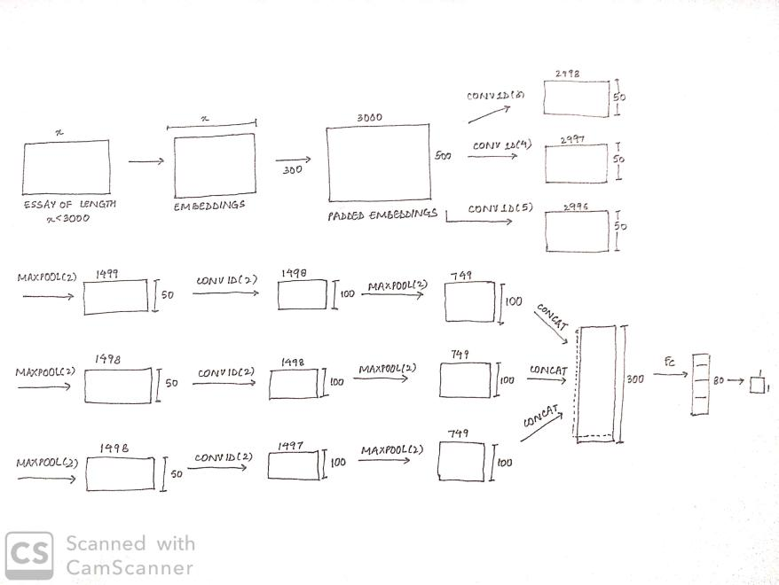
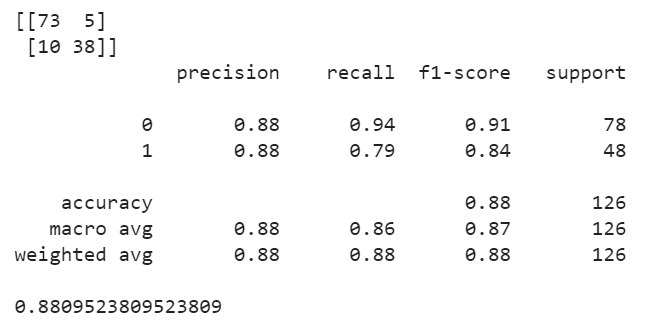

# A Deeper Look into Sarcastic Tweets Using Deep Convolutional Neural Networks

- [Paper](https://sentic.net/sarcasm-detection-with-deep-convolutional-neural-networks.pdf)
- [Dataset-Sentiment](https://www.kaggle.com/lakshmi25npathi/imdb-dataset-of-50k-movie-reviews)
- [Dataset-Personality](https://drive.google.com/file/d/1xTg5iJZzzNEf3jJJKhBpgwkMnYDHaKQJ/view?usp=sharing)
- [Dataset-Reviews](https://github.com/ef2020/SarcasmAmazonReviewsCorpus)
<!-- - [GloVe pre-trained](http://nlp.stanford.edu/data/wordvecs/glove.6B.zip) -->

## Authors
- [Sanchit Ahuja](https://github.com/sanchit-ahuja)
- [Abhinav Tuli](https://github.com/AbhinavTuli)
- [Abhijeet Borole](https://github.com/abhijeetborole)

#### [Drive Link for all models and datasets](https://drive.google.com/drive/folders/1j3gznRgPccFykFihfPFtiCPwvHIO1Cwl?usp=sharing)

## Objectives and Implementation
- Read the paper thoroughly and understood all the necessary requiremnents to apply the paper to our datasets.
- We needed to first implement two separate models and use these pre-trained models to train our final model using CNN-SVM classifier.
- The pre-trained model involved training a sentiment classifier and personality classifier using CNNs on word embeddings.
- We used the pre-trained 300 dimension GloVe embeddings.

## Setup
- Create the environment
  - Modify ```prefix``` in environment file to the location where you wish to install the environment
  
  ```bash
  conda env create -f environment.yml
  conda activate sarcasm
  ```
- **Directory Structure** :
    - Sentiment
        - Results
        - ```Sentiment_CNN.ipynb```
    - Personality
        - utils
        - ```Training_Personality.ipynb```
            - ```util_funcs.py```
        - datasets
        - Results
    - ```environment.yml```
    - Sarcasm
        - Sarcasm.ipynb
    - README.md
    - `.gitignore`

## Training the data
- You can train individual notebooks for sarcasm and personality datasets. 
- For personality, you will need to train for all the emotions individually. All the cleaned and separated emotions are there inside the Personality directory.
- You will need to change the PATH variable to your local path. You will also need to change the csv file names for loading into the dataloader in the notebook.
- We have provided all the pre-trained models in a drive link and its better to use them directly than training the model again.
- For sentiment, you can directly run the cells and train the model. The dataset was already available in the torchtext module.


## Results
## 1. Sentiment
Sentiment analysis is the interpretation and classification of emotions (positive and negative) within text data 
For training, we used the IMDB dataset consisting of 50000 highly polar movie reviews classified as either Positive or Negative. 
The train, validation and test split was 17500, 7500 and 25000 respectively.
Once the model was trained, we could extract the sentiment features from the first fully connected layer.

We experimented with a couple of CNN architectures, each having its own pros and cons.

The 2 different architectures:-
### Our modified version of the proposed model
#### Model Architecture


#### Train and Validation results


#### Test results


### Paper's model

#### Model Architecture


#### Train and Validation results


#### Test results


## 2. Personality
- The dataset that we used to classifying personality is called OCEAN dataset. It consists of five personalities majorly. \
    1. OPN - [O] Openness to experience. (inventive/curious vs. consistent/cautious)
    2. CON - [C] Conscientiousness. (efficient/organized vs. easy-going/careless)
    3. EXT - [E] Extroversion. (outgoing/energetic vs. solitary/reserved)
    4. AGR - [A] Agreeableness. (friendly/compassionate vs. challenging/detached)
    5. NER- [N] Neuroticism. (sensitive/nervous vs. secure/confident)
- The architecture we used for training the personality was a CNN architecture. It consists of a word embedding layer of 300 dimension,kernel size of 3,4 and 5 initially with a Feature map size of 50, a max pooling layer of 2 and for the second convolution layer we used a kernel size of 2 with 100 feature maps, and finally a FC layer of 80 (After a lot of experimentation)
- For personality, we had run couple of experiments dabbling with sending the complete text as well as chunking the text into sentences and then sending them to the network. We observed that chunking the text into sentences performed slightly better than sending the complete text. 
- For our experiment above we experimented with varied number of fully connected layer at the end. We tabulate our results below for both experiments down below.
### Model Architecture described below


### Complete text
- This experiment was done on a single personality and we extrapolated the results for other personalites as well.


| Fully connected layers       | Train acc.      | Val Acc  |
| ------------- |:-------------:| -----:|
| 70      | 92.05 | 58.32 |
| 80      | 99.85 |   62.30 |
| 90 | 98.19      |    58.50
| 100 |    99.95  |  58.84 |
| 110 |   99.55   |  60.48 |
| 120 |   89.06   |  59.45 |
| 130 |   99.50   |  58.47 |
| 140 |   99.75   |  58.27 |
| 150 | 99.95      |  62.15 |

### Text chunked into sentences

| Fully connected layers       | Train acc.      | Val Acc  |
| ------------- |:-------------:| -----:|
| 80      | 86.63 |   62.41 |
| 90 | 92.04|    59.91|
| 100 |    99.19  |  60.20 |
| 110 |   98.89  |  60.37 |
| 120 |   96.10   |  60.94 |
| 130 |   94.90   |  61.00 |
| 140 |   99.75   |  60.92 |
| 150 | 99.95      |  62.04 |

- We can observe that the chunked text converged significantly faster to a good accuracy as compared to the normal text. We also observed that the model with 80 fully connected layers worked the best.
- But the problem with using chunked text was that the features extracted from this model didn't improve the accuracy while making predictions for the final dataset (Amazon reviews). In the end, we stuck to the initial model i.e. sending the complete text to the model which gave us decent accuracy.
 - The above experiments were ran on OPN personality.

### The best results for all the 5 personalities are tabulated below.

| Personality       | Val Acc (Using text)      | Val Acc (Using chunks)  |
| ------------- |:-------------:| -----:|
| OPN      | 57.63 |   58.41 |
| NEU | 56.75|    57.55|
| EXT |    55.65  |  55.96 |
| CON |   52.89  |  52.19 |
| AGR |   53.28   |  52.65 |


## Limitations
- The major limitation is that the dataset for Personality is too small. As a result we had a significant amount of overfitting in our results. 

## 3.Sarcasm
- The dataset that we used to classifying sarcasm is the imbalanced Amazon Review dataset which consists of ironic and regular reviews. 
- For sarcasm, we experimented with several classifiers such as MLP, RF, KNN and Logistic Regression and ultimately SVM worked best for the use case with 88.09%.

### The best results are shown below.



### Instructions to run the Sarcasm notebook
- Please update the PATH variable to your working directory.
- The SentimentModel.pt, AGR.pt, CON.pt, EXT.pt, NEU.pt, OPN.pt files are the respective weights for the Sentiment Model and the Five personality models.
- The TEXT.pt, AGR_txt.pt, CON_txt.pt, EXT_txt.pt, NEU_txt.pt, OPN_txt.pt files are the respective Sentiment Embeddings and the Five Personality Embeddings.
- Store the sentiment weights and embeddings in your working directory.
- Store the personality weights and embeddings in a folder named Personality in your working directory.
- Store the reviews_w_stars.csv, which contains the parsed Amazon reviews in your working directory.